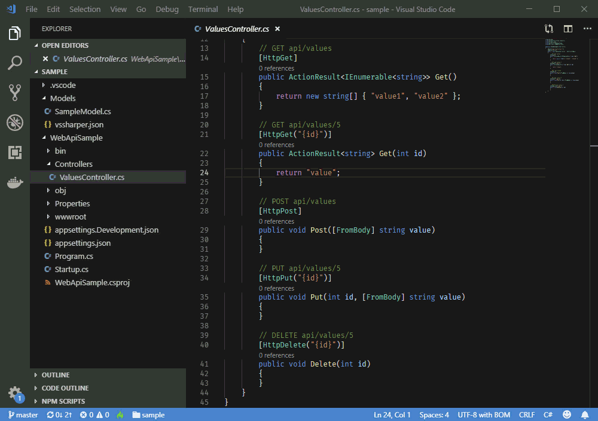

# VS Sharper VS Code Extension for C#

An extension to make developing C# projects in VS Code fun and productive.

## Installation

Install from within VS Code or through VS Code [Marketplace](https://marketplace.visualstudio.com/items?itemName=eservice-online.vs-sharper).

Requires an installation of .NET Core Runtime >= 2.1 (2.1, 2.2 or 3.0) or .NET Core SDK for some features.

## Features

### Add a New C# Class or Interface File

Creates a new class or interface file and generates an apropriate name for the namespace of the new file.


Use the File Explorer's context menu to add a class or interface file.

> Tip: See below on how to change the generated namespace's name.

### Embed Current Line or Selection

Embeds the current line or selection in a code control block.



Available code blocks:

* Block { ... }
* do { ... } while ();
* for (...) { ... }
* foreach (...) { ... }
* if (...) { ... }
* if (...) { ... } else { ... }
* lock (...) { ... }
* try { ... } catch { ... }
* try { ... } catch { ... } finally { ... }
* try { ... } finally { ... }
* using (...) { ... }
* while (...) { ... }

Keyboard shortcut: `CMD+I E` on macOS or `Ctrl+I E` on Windows and Linux

> Tip: The feature is also available in the code editor's context menu and in 'Quick fixes' after selecting text in the editor.

### Sort and group Using statements

Sorts `using` statements alphabetically and groups them by the first namespace part. The `System` and `Microsoft` namespaces are placed at the beginning.

For example:

```
using System.Text;
using Microsoft.Data;
using SomeOtherLibrary.Core;
using SomeOtherLibrary;
using System;
```

Becomes:

```
using System;
using System.Text;

using Microsoft.Data;

using SomeOtherLibrary;
using SomeOtherLibrary.Core;
```

Select 'Sort and Group Using Statements' from the 'Quick Fixes' menu when the editor caret is in a line with a `using` statement.

## Requirements

It is recommended to install the VS Code C# extension.

## Extension Settings

VS Sharper generates the name for the namespace of a new file from the project's folder structure. You can place a `vssharper.json` file in the projects root or any subfolder to overwrite the generated namespace name for this folder or any of its subfolders.

For example:

```
{
    "namespace": "MyProject"
}
```
The extension looks up the subfolders' chain for a `vssharper.json` file until it reaches the root of the project.

## Telemetry

This extension collects anonymous usage data like VS Code. You can use VS Code's telemetry setting to turn it off.

## Extension Commands

* Add a New C# Class File (`vsSharper.addCsharpClassFile`)
* Add a New C# Interface File (`vsSharper.addCsharpClassFile`)
* Embed Current Line or Selection (`vsSharper.embedSelection`)
* Embed Current Line or Selection into Code Block (`vsSharper.embedSelection.block`)
* Sort and group using statements (`vsSharper.sortUsings`)

## Known Issues

No known isssues.

## Release Notes

See: [Change Log](CHANGELOG.MD)

More features and productivity tools will be added in the coming weeks and months.

Please use Github to report issues or send any feature requests.
